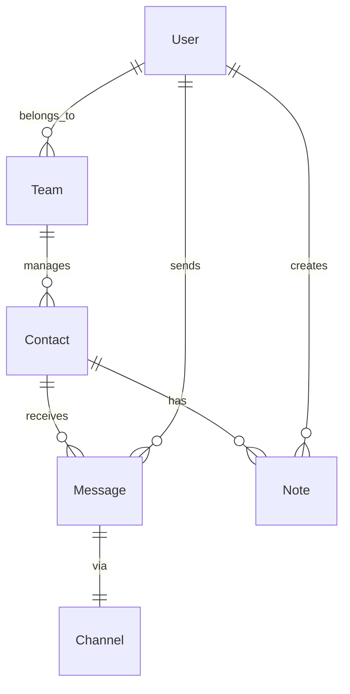

#  Unified Inbox - Multi-Channel Customer Outreach

> **Attack Capital Assignment**: A production-grade unified communication platform built with Next.js 14, TypeScript, and Prisma.

##  Project Overview

A centralized communication hub that aggregates messages from SMS (Twilio), WhatsApp (Twilio API), Email, and social media platforms into a single collaborative inbox for teams.

### Key Features

-  **Unified Inbox**: Threaded messages by contact across all channels
-  **Multi-Channel Support**: SMS, WhatsApp, Email, Twitter/X, Facebook Messenger
-  **Team Collaboration**: Real-time presence, notes, and @mentions
-  **Message Scheduling**: Automated follow-ups and campaign scheduling
-  **Analytics Dashboard**: Engagement metrics, response times, conversion funnels
-  **Contact Management**: Unified profiles with history and notes
-  **Role-Based Access**: Viewer, Editor, Admin roles via Better Auth

---

## 🛠️ Tech Stack

| Layer | Technology |
|-------|-----------|
| **Framework** | Next.js 14+ (App Router) |
| **Language** | TypeScript |
| **Database** | PostgreSQL via Prisma ORM |
| **Authentication** | Better Auth (Google + Credentials) |
| **Styling** | Tailwind CSS |
| **State Management** | React Query (TanStack Query) |
| **Real-time** | WebSockets + Y.js |
| **Integrations** | Twilio SDK, Resend, Twitter API v2, Facebook Graph API |
| **Code Quality** | ESLint, Prettier, Husky |

---

##  Quick Start

### Prerequisites

- Node.js 18+ and npm
- PostgreSQL database (local or cloud)
- Twilio account ([sign up here](https://www.twilio.com/try-twilio))
- Optional: Google OAuth credentials

### Installation

```bash
# Clone the repository
git clone <your-repo-url>
cd multi-channel-customer-outreach

# Install dependencies
npm install

# Set up environment variables
cp .env.example .env
# Edit .env with your credentials

# Run database migrations
npx prisma migrate dev

# Start development server
npm run dev
```

Visit [http://localhost:3000](http://localhost:3000)

---

##  Project Structure

```
├── app/                    # Next.js App Router pages
│   ├── api/               # API routes & webhooks
│   ├── (auth)/            # Authentication pages
│   ├── (dashboard)/       # Protected dashboard pages
│   └── layout.tsx         # Root layout
├── components/            # React components
│   ├── ui/               # Reusable UI components
│   ├── inbox/            # Inbox-specific components
│   └── analytics/        # Analytics components
├── lib/                   # Core utilities
│   ├── integrations/     # Channel integrations (Twilio, etc.)
│   ├── db.ts             # Prisma client
│   └── utils.ts          # Helper functions
├── hooks/                 # Custom React hooks
├── types/                 # TypeScript types
├── prisma/               # Database schema & migrations
│   └── schema.prisma     # Database schema
└── public/               # Static assets
```

---

##  Database Schema

### Core Entities

- **User**: Team members with roles
- **Team**: Multi-tenant team structure
- **Contact**: Unified contact profiles
- **Message**: Normalized messages across channels
- **Note**: Internal team notes on contacts
- **Channel**: Configuration for each communication channel
- **ScheduledMessage**: Automated message queue
- **Analytics**: Engagement metrics

### ERD Diagram



---

##  Channel Integrations

| Channel | Status | Latency | Cost | Reliability |
|---------|--------|---------|------|-------------|
| **Twilio SMS** | ✅ Core | ~1-3s | $0.0075/msg | 99.95% |
| **Twilio WhatsApp** | ✅ Core | ~1-2s | $0.005/msg | 99.9% |
| **Email (Resend)** | 🚧 Optional | ~2-5s | Free tier | 99% |
| **Twitter/X DMs** | 🚧 Optional | ~3-7s | Free | 95% |
| **Facebook Messenger** | 🚧 Optional | ~2-4s | Free | 97% |

### Setup Notes

- **Twilio**: Use trial number for testing; sandbox for WhatsApp
- **Social APIs**: Require OAuth app setup and webhook verification
- **Email**: IMAP polling vs. webhook-based (Resend recommended)

---

##  Authentication & RBAC

Powered by **Better Auth** with:

- **Providers**: Google OAuth, Email/Password
- **Roles**: 
  - `viewer`: Read-only access
  - `editor`: Can send messages and edit contacts
  - `admin`: Full system access

### Role Permissions Matrix

| Action | Viewer | Editor | Admin |
|--------|--------|--------|-------|
| View Inbox | ✅ | ✅ | ✅ |
| Send Messages | ❌ | ✅ | ✅ |
| Manage Contacts | ❌ | ✅ | ✅ |
| Schedule Messages | ❌ | ✅ | ✅ |
| View Analytics | ✅ | ✅ | ✅ |
| Manage Team | ❌ | ❌ | ✅ |
| Configure Channels | ❌ | ❌ | ✅ |

---

##  Analytics & Metrics

Tracked engagement metrics:

- **Response Time**: Average time to first response
- **Channel Volume**: Messages per channel
- **Conversion Funnel**: Lead → Response → Conversion
- **Open Rates**: Message read receipts (WhatsApp, Email)
- **Team Performance**: Messages sent per user

---

##  Development Workflow

### Available Scripts

```bash
npm run dev          # Start dev server
npm run build        # Production build
npm run start        # Start production server
npm run lint         # Lint code
npm run format       # Format with Prettier
npm run type-check   # TypeScript validation
```

### Git Workflow

- `main`: Production-ready code
- `develop`: Integration branch
- Feature branches: `feature/inbox-ui`, `feature/twilio-integration`, etc.

### Commit Conventions

```
feat: add WhatsApp integration
fix: resolve message threading issue
docs: update setup instructions
chore: upgrade dependencies
```

---

## 🔧 Configuration

### Environment Variables

See `.env.example` for all required environment variables.

**Critical Variables:**

```env
DATABASE_URL="postgresql://..."
TWILIO_ACCOUNT_SID="ACxxxxxxxxx"
TWILIO_AUTH_TOKEN="your_token"
BETTER_AUTH_SECRET="min-32-chars"
```

---

##  Architecture Decisions

### 1. **Channel Abstraction Layer**
Created a unified `ChannelSender` interface to normalize message sending across platforms:

```typescript
interface ChannelSender {
  send(payload: MessagePayload): Promise<MessageResult>;
  validate(payload: MessagePayload): boolean;
}
```

**Rationale**: Enables adding new channels without modifying core logic.

### 2. **Webhook Orchestration**
Centralized webhook handler at `/api/webhooks` with provider-specific routing and signature validation.

**Rationale**: Security and maintainability for multiple webhook sources.

### 3. **Message Normalization**
Single `Message` table with `channelType` and polymorphic `metadata` JSON field.

**Rationale**: Simplifies querying while preserving channel-specific data.

---
